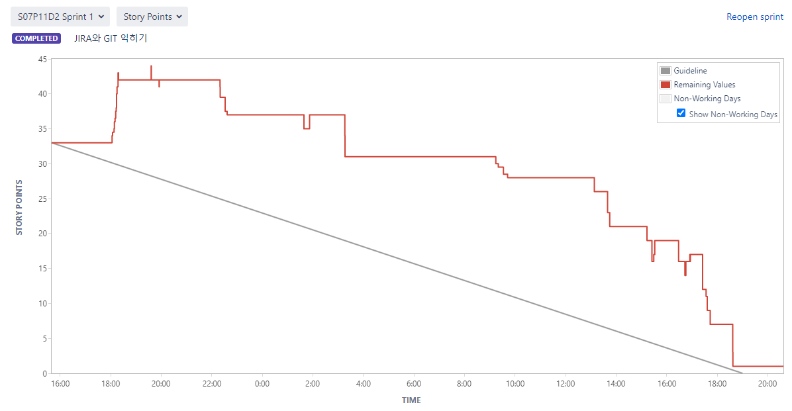
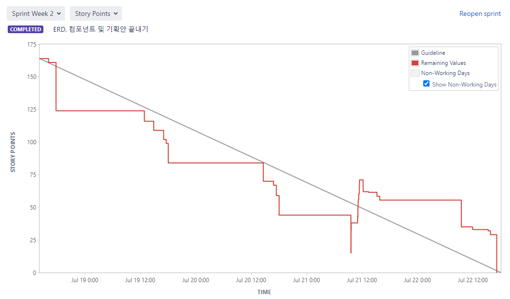
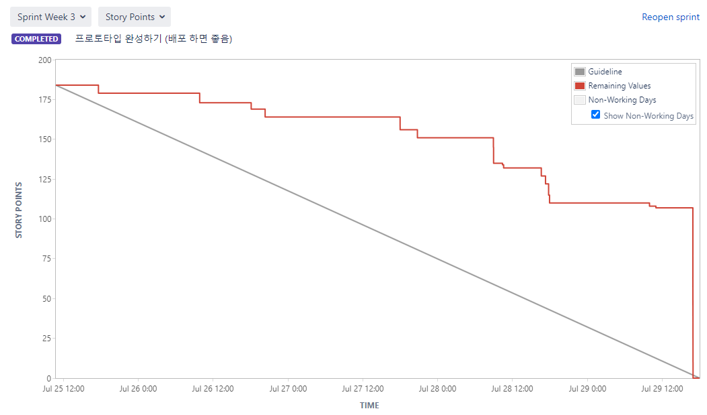
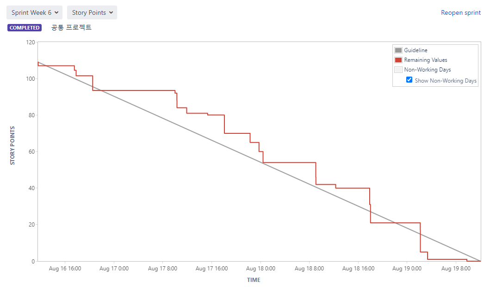

# SSAFY 7기 공통프로젝트

> 도메인: 웹/모바일 프로젝트 (웹 IoT)


* 팀장: 허건녕

* 팀원: 김민정, 박신혜, 오도석, 최연지

* 프로젝트 기간: 2022.07.05 ~ 2022.08.19. (6주)
* 프로젝트명: 나의 단짝친구
* 프로젝트 소개: 소아 병동에 장기 입원 중인 아이들에게 정서적 안정과 즐거움, 위로와 공감을 주는 친구


## 목차

* [프로젝트 기술 스택](#프로젝트-기술-스택)
* [Jira Burndown Chart](#jira-burndown-chart)
* [KPT](#kpt)
  * [Keep](#keep)
  * [Problem](#problem)
  * [Try](#try)
* [Timeline](#timeline)
  * [2주차](#2주차)
  * [3주차](#3주차)
  * [4주차](#4주차)
  * [5주차](#5주차)
  * [6주차](#6주차)
* [느낀점](#느낀점)


## 프로젝트 기술 스택

1. 이슈관리: Jira

2. 형상관리: Gitlab

3. 커뮤니케이션: Mattermost, Notion, Webex

4. 개발 환경 

   a) OS: Windows 10 

   b) IDE 

   ​	i) IntelliJ IDEA 2022.1.4 

   ​	ii) Visual Studio Code 1.69.0 

   c) Database: MySQL Workbench 8.0 CE 

   d) Server: AWS EC2(MobaXterm 22.1) 

   ​	i) Ubuntu 20.04.4 LTS 

   ​	ii) Jenkins 2.346.2 

   e) Storage: Firebase Storage

5. 상세내용 

   a) BackEnd 

   ​	i) Java 1.8.0 

   ​	ii) Spring Boot Gradle 7.5 

   ​	iii) Lombok 1.18.24, Swagger2 

   ​	iv) jjwt 0.9.1 

   b) FrontEnd 

   ​	i) React 18.0 

   ​	ii) Node.js 16.16 

   ​	iii) Three.js r143 

   c) IoT 

   ​	i) Python 3.10.5 

   ​	ii) OpenCV 4.6.0.66 (latest) 

   ​	iii) pyQt5 5.15.7 (latest) 

   ​	iv) Arduino 1.8.19 

   ​	v) Naver Clova Voice & Speech Recognition


## Jira Burndown Chart

1. 1주차 (JIRA와 GIT 익히기)

   

2. 2주차 (ERD, 컴포넌트 및 기획안 끝내기, 개발 시작)

   

3. 3주차 (프로토타입 완성하기, 배포)

   

4. 4주차 (Web 마무리)

   

5. 5주차 (모든 기능 구현 완료)

   

6. 6주차 (기능 수정 및 Documentation, 발표준비)

   


## KPT

```
💡	Keep	좋았던 점, 앞으로 계속 유지할 사항
	Problem	아쉬웠던 점, 개선되어야 할 사항, 사건에 이르는 과정
	Try		problem 때 상황에서의 구체적인 시도, 차기 목표/목적
```

### Keep

* 주제선정: 편안하게 아이디어를 말할 수 있는 분위기를 조성해서 좋았다.
* 주제선정: 여섯모자 기법을 적용해서 주제에 대해 생각할 수 있는 시간을 많이 가질 수 있었다.
* JIRA: **애자일 방법론(Agile Methodology)**을 적용해서 주마다 일정을 관리했다. 일정 변동사항이 생길 때 빠르게 업데이트 할 수 있었다.
* API 연결: 서버 API와 WEB을 연결할 때 기획 단계에서 생각하지 못했던 문제들이 발생했는데, 백과 프론트의 활발한 소통으로 하나씩 빠르게 해결할 수 있었다.

### Problem

* 주제선정: 주제를 정하고 나서 선정한 이유를 생각하려고 하니까 어려웠고 여러 번 주제를 바꿨다. 발표 시에도 프로젝트를 설명하는 데 명확한 방향을 잡기가 어려웠다.
* 주제선정: 주제선정에 있어서 비판적인 시각이 부족해서 주제선정에 어려움을 겪음.
* 기획: 피그마 초안을 작성할 때 컴포넌트를 구체적으로 정하려고 하니까 개발이 늦어졌다. 반면 디자인 부분은 작성하지 않아서 개발 도중 다시 피그마를 작성해야 했다.
* JIRA: 개발하느라 바쁠 때 JIRA 관리를 잘 하지 못해서 뒤늦게 done을 해서 Burn-down 차트가 아쉬웠다.
* 에러 코드: 개발을 하면서 여러 에러가 발생하는데, 따로 정리해두지 않으니까 나중에 에러가 발생했던 상황과 원인, 해결방법을 기억하기가 힘들다.
* 에러 관리: 현재는 개발 중 develop이 main이고, 에러가 발생하면 feature branch를 파서 관리한다. feature는 기능 개발을 위한 브랜치라서 브랜치 관리가 세세하지 못했다.
* 문서화 작업: 주마다 한 작업을 기록하지 않아 떠올리기 힘들다.

### Try

* 주제선정: why를 먼저 생각하고 그 해결책을 찾는 식으로 주제를 선정하면 좋을 것 같다.
* 주제선정: notion에 모든 주제를 정리하고 하나씩 주제에 대한 이야기를 해봄으로써 자연스럽게 주제에 대한 다양한 시각으로 접근이 가능했고 주제선정에 도움이 되었다.
* 기획: 피그마 작성 시 계속해서 수정하는 것은 좋지만 단계별로 나눠서 점점 build-up 하자.
  - 예시
    - v1: 주요 기능
    - v2: 세부적인 기능
    - v3: UI 통일성 및 UX 증가
* JIRA: GitLab과 연동하면 Jira에 큰 신경을 쓰지 않고 편하게 관리할 수 있을 것 같다.
* 에러 코드: 개발을 하면서 발생한 에러를 발생상황과 원인, 해결방법을 기록해두자.
* 에러 관리: fix 브런치를 따로 생성해서 에러를 단독으로 관리하자.
* 문서화 작업: 스프린트가 끝나면 회고를 통해 문서로 남겨놓자.
* 코드 리뷰: 매주 최소 한 번 코드 리뷰를 하는 시간을 가져서, 서로의 진행 상황을 파악하고 기능을 모두 이해하자.


## Timeline

```
💡	프로젝트 진행 기간 중 이슈, 사건을 기준으로 시간 순 회고
```

### 2주차

> ERD, 컴포넌트 및 기획안 끝내기, 개발 시작

* ERD, Figma로 UI 초안, diagrams.net에서 컴포넌트 구조를 기획함.
* JIRA 스토리 타임을 너무 적게 배분해서, 제대로 된 일정관리를 하기 힘들었다.
* 기획안 및 기획발표 준비.


### 3주차

> 프로토타입 완성, 배포

* EC2내의 jenkins계정에서 java version과 프로젝트의 java version이 일치하지않아서 build되는 과정에서 오류가 발생했다.

  - 해결 : `update-alternatives --list java` 로 설치된 java list를 확인하고

    `sudo update-alternatives --config java` 와 `sudo update-alternatives --config javac`를 사용해서 java version을 변경해주었다.

* Web: React Public/PrivateRoute

  - 배경: 로그인된 사용자인지 안한 사용자인지에 따라 url 접근 권한을 따로 줘야하는데, React 버전이 v6.0으로 바뀜에 따라 코드가 많이 바뀌었다.
  - 주요 에러: 일반적으로 PublicRoute.jsx, PrivateRoute.jsx 파일을 만들어서 App.js에서 불러오는 방식인데, v6.0에서는 Switch → Routes, Redirect → Navigate로 변경됐다.
  - 해결: `<Route></Route>` 안에서 `element={<PublicRoute/>}` 이런 식으로 코드를 작성한다.

* Web과 서버를 연동할 때 DB가 몇 번 수정됐고 axios 요청 에러가 많이 발생했다.

  - 문제1: axios 요청을 보낼 때 memberID를 보내야 하는데 memberId를 보내서 에러가 났다.
  - 문제2: 회원정보 수정 시 axios 처리는 성공했는데 204 코드가 뜨고 DB가 바뀌지 않는다.
  - 해결2: name, phoneNumber만 보냈는데 memberId도 추가적으로 보내줘야 한다.
  - 문제3: 회원탈퇴를 하면 DB에서 삭제되지 않고 `isDeleted=true`가 되도록 했더니 회원가입 시 탈퇴처리된 회원이 이메일 주소를 사용하지 못하고(동일인 재가입 불가), 로그인할 때도 isDeleted에 대한 조건을 다 달아줘야 했다.
  - 해결3: 회원탈퇴를 하면 `isDeleted=true`로 바꾸지 않고 바로 DB에서 삭제되도록 했다.

* 프로토타입의 request, response 시에 CORS에러가 발생했다.

  - 원인 : 프론트와 백에서의 port번호가 달라서 발생
  - 해결 : 백에서 특정 url에서 오는 request를 허용하게 했다.
    - prefligt request 에러 발생
      - 원인  : 본격적인 http request전에 서버측에 예비 request를 보내서 권한체크를 하는데 요청이 유효한지 확인을 하는데 서버에서 요청의 헤더에 권한체크를 하는 부분이 빠져있었다.
      - 해결 : filter를 적용해서 서버에서 특정 url로 response를 보낼때 `Access-Control-Allow-Origin`등의 필요한 부분을 header에 추가해서 response 해줌으로써 웹에서 권환을 확인하고 요청이 유효함을 확인했다.


### 4주차

> Web 마무리

* 웹 프론트를 초반에는 두 명이 같이 했는데, 그 과정에서 변수명이 의미하는 것이 무엇인지 많이 헷갈렸다.
  - 해결: 변수명이 의미하는 것이 무엇인지, 데이터를 어떤 식으로 가져오는지를 한 파일에 정리해두고 헷갈릴 때마다 참고했다.
* 라즈베리파이로 프로젝트를 구현하는 것을 계획했지만 웹과 환경이 달랐고, 우리가 기존에 계획한 대로 코드를 구현할 수 없었다.
  - 우리 프로젝트의 큰 부분 중 하나가 3D렌더링이었고 라즈베리 파이는 이를 구현할 수 없었기 때문에 프로젝트 방향을 수정했어야했다.


### 5주차

> 모든 기능 구현 완료

* 백앤드에서 개발된 기능을 하나의 노드서버를 통해 실행 시키는 역할을 수행했다. 하지만 모든 파일의 기본 경로가 전부 달라졌고, 파이썬 버전도 통일되지 않았기 때문에 하나의 기능을 연결할때마다 에러를 경험해야 했다.
* 개발하는 중 여러 HTTP 상태코드를 만났고 상태코드 각각의 원인과 해결 방법을 정리했다.
  - 200(Success)
    1. 의미: 서버가 요청을 제대로 처리했다는 뜻. 서버가 요청한 페이지를 제공했다는 의미로 쓰인다.
    2. 설명: 이 코드가 뜬다면 axios 요청이 제대로 수행됐다는 것이기 때문에 안심하면 된다.
  - 204(No Content)
    1. 의미: 서버가 요청을 성공적으로 처리했지만 콘텐츠를 제공하지 않는다.
    2. 설명: 내 생각으로는 제일 골치아픈 상태 코드였다. axios 성공은 했지만 DB에는 저장되지 않았다.
    3. 해결: 서버 측에 문의를 해야한다. 서버 측에서 요청을 승인할 때 state code와 함께 content를 줘야한다.
  - 400(잘못된 요청)
    1. 의미: 서버가 요청의 구문을 인식하지 못했다.
    2. 해결: url을 확인한다 (`/` 같은 것들)
  - 403(Forbidden, 금지됨)
    1. 의미: 서버가 요청을 거부하고 있다. 예로, 사용자가 리소스에 대한 필요 권한을 가지고 있지 않다.
    2. 설명: axios 요청을 했을 때 자주 나온 코드로, 서버에 넘겨줘야 하는 데이터들을 다 넘겨주지 않았다는 의미.
    3. 해결: data나 headers를 잘 확인해야 한다. 특히 data를 넘겨줄 때 오타는 없는지, undefined인 데이터는 없는지 봐야 한다.
    4. 참고: 만약 제대로 동작하는 것을 확인했는데 한참 뒤에 웹에 들어왔을 때 403 에러가 뜨는 경우가 있다. 이 때는 로그아웃하지 않고 나갔기 때문에 토큰이 만료됐고 따라서 headers 부분이 잘못됐기 때문이다. 따라서 로그아웃을 하고 다시 로그인을 하면 해결된다. / 회원탈퇴했는데 로그인했을 경우에도 403 코드가 뜬다.
  - 404(Not Found, 찾을 수 없음)
    1. 의미: 서버가 요청한 페이지(Resource)를 찾을 수 없다. 예로, 서버에 존재하지 않는 페이지에 대한 요청이 있을 경우 서버가 이 코드를 제공한다.
    2. 설명: React를 활용한 경우 웹에서 Route를 통해 url을 만들어주는데, 이렇게 만들어진 url 주소가 아닌 다른 주소를 입력했을 경우 나온다.
    3. 해결: 클라이언트 측의 실수이기 때문에 제대로 된 url로 들어가면 해결된다. 가장 간단하게 해결할 수 있는 에러이다. 보통 웹에서 url을 다 할당하고 나서 "*" Route를 하나 더 만들어서 404 코드를 보여주는 페이지를 띄우는 식으로 사전처리를 해준다.
  - 500(내부 서버 오류)
    1. 의미: 서버에 오류가 발생하여 요청을 수행할 수 없다.
    2. 설명: 여러 원인이 있는데, 주된 원인은 CORS와 웹에서의 잘못된 데이터 전송이다.
    3. 해결:
       1. CORS 에러의 경우 서버에서 처리를 해줘야 한다. 현 프로젝트에서는 필터 처리로 해결했다.
       2. 웹에서 잘못된 데이터를 전송한 경우에도 에러에 CORS가 뜰 수 있기 때문에 만약 서버에서 CORS를 다 해결했는데도 500 에러(혹은 CORS 에러 문구)가 뜬다면 403 상태코드 경우처럼 올바른 데이터를 서버에 전송했는지를 확인하면 된다.


### 6주차

> 기능 수정 및 Documentation, 발표준비

* 웹소켓 연결이 되지 않거나, 중복연결 되는 문제가 발생했다. 웹에서 한번 연결을 시도하는 코드를 작성하면 한번에 소켓에 들어오지않아 새로고침 과정을 겪어야하는 불편한 과정을 거쳐야했고, 여러번 소켓연결을 시도한다면 소켓에 여러명의 사용자가 들어가는 문제가 발생했다.
  - 소켓을 전역변수로 사용하기위해서는 Redux를 사용해야했지만 우리는 Recoil을 사용했기 때문에 프론트에서 해결하기에는 한계가 있었다(app.js에서 소켓연결 후 전역변수로 관리해야했음).
  - 해결 : 노드서버안에서 중복사용자를 제거하는 코드를 작성함으로써 중복입력되는 소켓을 제거했다.
* 얼굴 인식 기능 실행 시 IndexError가 발생했다.
  - 해결: Firebase Storage에 저장된 이미지에 얼굴이 없으면 인코딩 배열이 비어있어서 IndexError가 발생했다. 인코딩 배열의 길이를 확인하고, 저장된 사진 중 얼굴이 없는 사진을 삭제하니 해결되었다.
* Web Firebase에 있는 이미지의 URL를 가져와서 내 컴퓨터에 이미지 저장을 하고자 했는데 계속해서 실패했다.
  - 해결:
    - 먼저 이미지 URL이 필요하고, XMLHttpRequest()를 사용한다.
    - 그 다음에는 'a' tag를 만들고 거기에 URL을 넣고 다운로드 하는 과정인 것 같다.
    - 그 다음 open, send 과정을 통해 로컬에 이미지가 저장된다.
* 반응형 웹을 만들어서, WebView로 앱을 추출하고자 했다. kotlin 문법을 사용했는데 naver, google과 같은 페이지는 잘 되는데 우리 프로젝트 페이지는 화면에 뜨지 않았다.
  - 원인: 구글에서 kotlin으로 작성된 webview 코드를 참고했는데, 화면을 띄우는 부분에 빠진 코드가 있었다.
  - 해결: Java 코드를 사용하고 `MainActivity.java`에 화면을 띄우는 조건을 추가했다.
* request에 따른 mixed content 발생
  - 원인 : http로 만든 iot control site 에서 서버로 https  socket request가 발생해서 http → https 로 인한 mixed content 오류가 발생함.
  - 해결 : socket server로 요청을 http로 하되 certbot의 인증서와 nginx를 활용해서 reverse proxy 로 https 변환 요청을 했다.


## 느낀점

```
📌 프로젝트를 마무리하면서..
```

### 김민정

```
프로젝트 주제 선정부터 기획, 개발까지 모두 자율적으로 해보는 것은 처음이었는데 팀원들과 함께여서 하나씩 해나갈 수 있었던 것 같다. 서버와 웹을 연결할 때, 혹은 기능을 추가할 때 여러 문제가 있었는데 팀원들과 계속해서 소통하고 있어서 빠르게 해결 가능했다. 
처음 계획했던 일정이 틀어지는 경우도 종종 있었는데, 이런 과정을 통해 애자일 방법론을 더 잘 경험할 수 있지 않았을까 생각한다. 
비록 프로젝트에 들어가진 않았지만 Phaser, WebView 등 다양한 프레임워크와 컴포넌트들을 경험할 수 있어서 좋았다.
```

### 박신혜

```
각자 구현한 기능을 연결하는 과정에서 소통의 중요성을 알게 되었고, 깃과 지라를 이용해서 협업하는 능력을 더 키울 수 있었다. 좋은 팀원분들 만나서 즐겁게 새로운 기술을 배우며 프로젝트 진행할 수 있어서 좋았다. 
다음 프로젝트에서는 Jenkins와 Docker를 이용하여 CI/CD 구축도 경험해보고 싶다.
```

### 오도석

```
새로운 기술을 잘 이해하고 사용하는 것도 중요하지만 팀원들과의 소통 또한 매우 중요하다는걸 느꼈다.
```

### 최연지

```
프로젝트 주제 선정부터 설계, 구현까지의 과정이 쉽지는 않았지만, 팀원과의 소통을 통해 끝까지 잘 구현할 수 있었던 것 같습니다. 또 Back-End Rest API 구현 시 여러 번 테스트를 해봤음에도 불구하고 생각지도 못한 오류나 추가해야 할 기능들이 많아서 설계를 세심하게 하지 못한 것에 아쉬움을 느꼈습니다. 이번 경험을 바탕으로 Back-End 설계 시 다양한 상황들을 생각해보고, 테스트도 Swagger에서만 하는 것이 아니라 Front 환경에서도 해봐야겠다고 느꼈습니다.
```

### 허건녕

```
우선 기획부터 프로젝트를 진행하는 것은 처음이였는데, 제가 생각했던 것보다 훨씬 힘든 과정이였습니다. 여러 사람의 의견을 취합하는 과정에서 어떤 의견을 들고가고, 어떤 의견을 버릴지 어려웠던것 같습니다. 개발 과정에서는 초기에 api명세, ui 디자인 등 초기에 꼼꼼하게 짚고 넘어가지 않았던 것이 후회됐습니다. 그 당시에 조금 귀찮아서 금방 넘어갔던 부분들이 개발 시간을 오래 소요하게 만들었던 것 같습니다. 새로운 기술을 공부하며 너무 낯설어서 힘들었지만, 오히려 새로운 목표가 생긴것 같아 뿌듯한 프로젝트였습니다.
```


---


