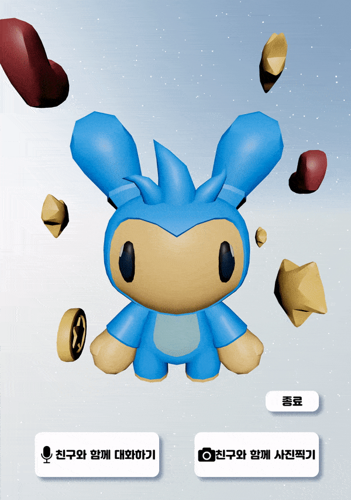
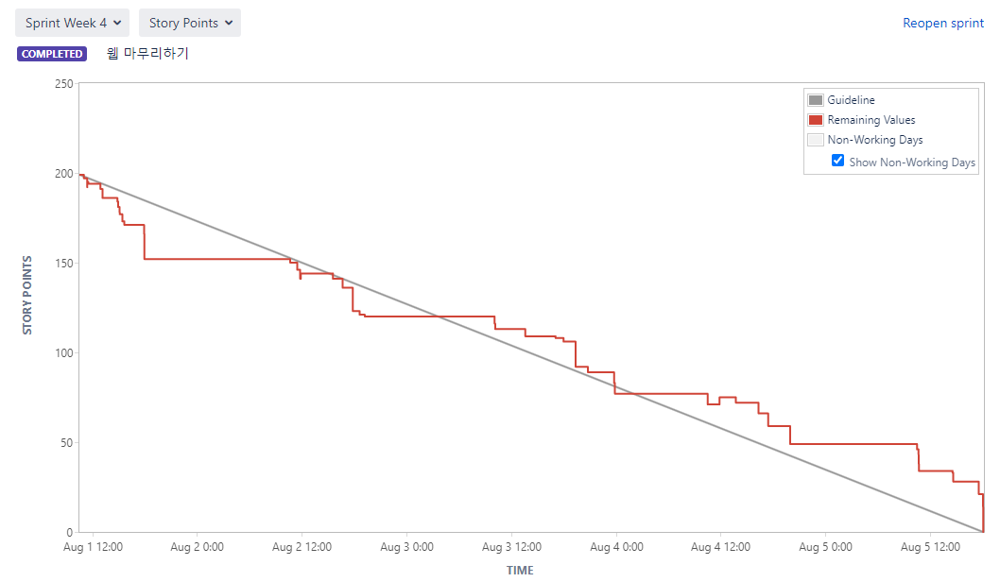

# 👶나의 단짝친구

> 도메인: 웹/모바일 프로젝트 (웹 IoT)

- 팀명: 멋쟁이들
- 팀원: 허건녕(팀장), 김민정, 박신혜, 오도석, 최연지
- 프로젝트 기간: 2022.07.05 ~ 2022.08.19. (6주)
- 프로젝트명: 나의 단짝친구
- 프로젝트 소개: 소아 병동에 장기 입원 중인 아이들에게 정서적 안정과 즐거움, 위로와 공감을 주는 친구

## 목차

* [프로젝트 기술 스택](#프로젝트-기술-스택)
* [ERD](#erd)
* [프로젝트 소개](#프로젝트-소개)
* [프로젝트 기능](#프로젝트-기능)
* [기대효과](#기대효과)
* [향후 계획](#향후-계획)
* [팀원 역할](#팀원-역할)
* [느낀점](#느낀점)
* [Jira Burndown Chart](#jira-burndown-chart)
* [산출물](#산출물)

 

## 프로젝트 기술 스택

1. 이슈관리: Jira

2. 형상관리: Gitlab

3. 커뮤니케이션: Mattermost, Notion, Webex

4. 개발 환경

   a) OS: Windows 10

   b) IDE: IntelliJ IDEA, Visual Studio Code

   c) Database: MySQL Workbench 8.0 CE

   d) Server: AWS EC2(MobaXterm 22.1)

   i) Ubuntu 20.04.4 LTS

   ii) Jenkins 2.346.2

   e) Storage: Firebase Storage

5. 상세내용

   a) BackEnd: Java 1.8.0, Spring Boot Gradle 7.5, Lombok 1.18.24, Swagger2, jjwt 0.9.1

   b) FrontEnd: React 18.0, Node.js 16.16, Three.js r143

   c) IoT: Express 4.18 Python 3.10.5, OpenCV 4.6.0.66 (latest), pyQt5 5.15.7 (latest), Arduino 1.8.19, Naver Clova Voice & Speech Recognition

 

## ERD

 

## 프로젝트 소개

### 1. 나의 단짝친구

"나의 단짝친구"는 SSAFY에서 시작한 웹 IoT 프로젝트로, 장기 입원으로 지친 소아 환우들을 위한 정서적 안정과 즐거움을 주는 IoT 기기 개발을 목표로 시작되었다.

반응형 웹을 통해 모바일과 웹 버전을 모두 지원함으로써 사용자 접근성을 높였으며, IoT 기기와 실시간 소통할 수 있다.

**Keyword**

1. 맞춤형: 아이가 직접 캐릭터 선택 가능
2. 소통: 웹과 IoT 기기를 통해 부모님 혹은 보호자가 아이에게 이야기를 전달하거나 채팅을 통해 대화
3. 즐거움: 아이가 캐릭터와 상호작용을 하고 그 외에도 제공되는 다양한 활동을 통해 지친 병원 생활에 활력소가 됨

### 2. 기획 배경

소아병동에서 오랜기간 입원하여 치료받는 아이들의 지루함, 답답함 등의 해소 필요

단짝 친구를 만들어 상호작용을 할 수 있는 IoT 프로젝트 계획

 

## 프로젝트 기능

### 1. 회원 정보 관리

1. 시작 페이지

   

   

2. 회원가입

   

3. 회원정보 수정

   

4. 회원 탈퇴

   

### 2. 아이 정보 등록

1. Step1. 아이 이름, 별명, 생년월일, 입원일자를 필수로 입력한다.

   

2. Step2. IoT 기기에서 얼굴 인식 로그인에 사용할 사진을 등록한다.

   

3. Step3. IoT 기기에 뜨는 캐릭터를 고르고 별명을 짓는다.

   

4. Step4. 아이에게 해주고 싶은 말을 등록한다. 여기서 작성한 글이 IoT 기기에서 컴포넌트를 통해 아이에게 전달된다.

   

### 3. 아이 정보 수정 및 삭제

1. 아이에게 해주고 싶은 말 CRUD

   

2. 아이 정보 수정

   

3. 아이 정보 삭제

   

### 4. IoT 기기 로그인/메인화면

1. 로그인
   
   - IoT기기에 가까이 다가가면 초음파센서로 인식하여 얼굴인식기능이 시작된다.
   - 웹을 통해 가입된 사용자라면 얼굴인식 기반 로그인이 되며 캐릭터가 나타난다.
   - 캐릭터를 클릭하면 메인화면으로 이동한다.
   
   

2. 메인화면

   - 메인화면에는 3D 캐릭터와 함께 다양한 컴포넌트들이 렌더링된다.
   - 캐릭터의 대사에 따라 컴포넌트들을 터치한다면 보호자가 등록한 아이에게 해주고싶은말이 TTS를 통해 캐릭터 음성으로 재생된다.
   
   

### 5. IoT 카메라

#### IoT

- 다양한 필터를 고를 수 있으며, 사진 촬영 버튼을 누르면 현재 카메라에 보이는 화면과 필터가 합성된 사진을 찍고 저장한다.
- 종료 버튼을 누르면 카메라 필터 기능을 종료할 수 있다.
- 필터는 총 5가지로 이루어져 있다.

#### Web

- IoT 기기에서 사진을 찍으면 웹에서 사진을 확인할 수 있다.
- 사진을 클릭하면 사진을 확대해서 볼 수 있고, 저장할 수 있다.
- 저장 아이콘을 누르면 자동 다운로드 되며, 파일 이름은 ‘photo’, 확장자는 ‘.jfif’이다.

### 6. 실시간 채팅

1. 웹소켓의 on메소드로 채팅을 수신하면 오른쪽 아래 메세지 표시가 빨간색으로 변함

   

2. 웹소켓의 소켓정보를 활용해서 특정 클라이언트에게 emit메소드로 메세지 전송

   

#### IoT

- 메인 화면에서 ‘친구와 함께 대화하기’ 버튼을 누르면 채팅 페이지로 이동
- 아이가 마이크 버튼을 누르고 하고싶은 말을 하면 아이의 음성이 약 5초 동안 녹음이 되고, 녹음된 음성은 Naver STT API를 통해 텍스트로 변환
- 변환된 텍스트는 보호자에게 채팅으로 전달
- 보호자가 웹에서 채팅을 치면, 해당 채팅은 Naver TTS API를 통해 음성으로 변환되어 아이에게 음성 전달
- 아이가 벌꿀 캐릭터를 터치하면 벌꿀 캐릭터가 함께 움직인다.

#### Web

- 아이가 채팅에 들어온다면 채팅 아이콘에 빨간색 불이 들어온다.
- 해당 아이콘을 누르면 채팅을 할 수 있다.
  - 웹 또는 앱에서 채팅을 보내면 IoT 기기에서 음성을 바뀌어서 아이에게 들린다.
  - 마찬가지로 아이가 말을 하면 텍스트로 바뀌어서 채팅방에 대화가 뜬다.

 

## 기대효과

1. 확장성
   1. 책 읽기, 스트레칭 등 여러 기능을 추가함으로써 서비스 확장이 가능함
2. 소통
   1. 자신만의 캐릭터라는 것에 친밀감을 느끼고 힘들 때 말할 수 있는 곳이 생김
   2. 부모님이 아이에게 물어보고 싶은 이야기나 하고 싶은 이야기를 기기를 통해 전달할 수 있음
3. 공감
   1. 병원에 무서움을 느끼는 아이들이 정서적 위안을 얻을 수 있음
   2. 사진 찍기 등의 프로그램을 통해 병원에서 추억을 만들 수 있음

 

## 향후 계획

1. 버전 업그레이드를 통해 기능 추가
2. 기능 및 UI 개선으로 실제 소아병동에 활용

 

## 팀원 역할

| 팀원   | 직무      | 주요 업무                                                    |
| ------ | --------- | ------------------------------------------------------------ |
| 김민정 | Front-End | React를 활용한 반응형 웹 제작, Firebase를 활용한 이미지 업로드 및 다운로드 관리, apk 파일 추출 |
| 박신혜 | Back-End  | 백엔드 API 개발(질문 및 답변), 얼굴 인식 로그인              |
| 오도석 | Back-End  | 백엔드 API개발(캐릭터 선택), 실시간 채팅서버 구축, IOT캡쳐기능 개발, 자동배포 |
| 최연지 | Back-End  | 백엔드 API 개발(회원 및 아이 정보 관리), TTS/STT를 이용한 녹음 및 음성 ↔ 텍스트 변환 |
| 허건녕 | Front-End | React를 활용한 반응형 웹 제작, IoT Express 서버를 활용한 기능 연결, IoT Three.js 렌더링 |

 

## 느낀점

> 📌 프로젝트를 마무리하면서..

| 팀원   | 느낀점                                                       |
| ------ | ------------------------------------------------------------ |
| 김민정 | 프로젝트 주제 선정부터 기획, 개발까지 모두 자율적으로 해보는 것은 처음이었는데 팀원들과 함께여서 하나씩 해나갈 수 있었던 것 같다. 서버와 웹을 연결할 때, 혹은 기능을 추가할 때 여러 문제가 있었는데 팀원들과 계속해서 소통하고 있어서 빠르게 해결 가능했다. 처음 계획했던 일정이 틀어지는 경우도 종종 있었는데, 이런 과정을 통해 애자일 방법론을 더 잘 경험할 수 있지 않았을까 생각한다. 비록 프로젝트에 들어가진 않았지만 Phaser, WebView 등 다양한 프레임워크와 컴포넌트들을 경험할 수 있어서 좋았다. |
| 박신혜 | 각자 구현한 기능을 연결하는 과정에서 소통의 중요성을 알게 되었고, 깃과 지라를 이용해서 협업하는 능력을 더 키울 수 있었다. 좋은 팀원분들 만나서 즐겁게 새로운 기술을 배우며 프로젝트 진행할 수 있어서 좋았다. 다음 프로젝트에서는 Jenkins와 Docker를 이용하여 CI/CD 구축도 경험해보고 싶다. |
| 오도석 | 프로젝트 기획 및 설계, 구현 까지 많은 부분을 진행하면서 팀원들과 소통하고 기능을 나눠서 개발하는 좋은 경험이었습니다. Node.js를 활용한 실시간 채팅서버를 구현하였는데 부족한 부분이 많았다고 생각한다. 다음에는 조금더 보완해서 완벽한 1:1 채팅을 구현할 수 있도록 해보겠습니다. |
| 최연지 | 프로젝트 주제 선정부터 설계, 구현까지의 과정이 쉽지는 않았지만, 팀원과의 소통을 통해 끝까지 잘 구현할 수 있었던 것 같습니다. 또 Back-End Rest API 구현 시 여러 번 테스트를 해봤음에도 불구하고 생각지도 못한 오류나 추가해야 할 기능들이 많아서 설계를 세심하게 하지 못한 것에 아쉬움을 느꼈습니다. 이번 경험을 바탕으로 Back-End 설계 시 다양한 상황들을 생각해보고, 테스트도 Swagger에서만 하는 것이 아니라 Front 환경에서도 해봐야겠다고 느꼈습니다. |
| 허건녕 | 우선 기획부터 프로젝트를 진행하는 것은 처음이였는데, 제가 생각했던 것보다 훨씬 힘든 과정이였습니다. 여러 사람의 의견을 취합하는 과정에서 어떤 의견을 들고가고, 어떤 의견을 버릴지 어려웠던것 같습니다. 개발 과정에서는 초기에 api명세, ui 디자인 등 초기에 꼼꼼하게 짚고 넘어가지 않았던 것이 후회됐습니다. 그 당시에 조금 귀찮아서 금방 넘어갔던 부분들이 개발 시간을 오래 소요하게 만들었던 것 같습니다. 새로운 기술을 공부하며 너무 낯설어서 힘들었지만, 오히려 새로운 목표가 생긴것 같아 뿌듯한 프로젝트였습니다. |

 

## Jira Burndown Chart

1. 1주차 (JIRA와 GIT 익히기)

   

2. 2주차 (ERD, 컴포넌트 및 기획안 끝내기, 개발 시작)

   

3. 3주차 (프로토타입 완성하기, 배포)

   

4. 4주차 (Web 마무리)

   

5. 5주차 (모든 기능 구현 완료)

   

6. 6주차 (기능 수정 및 Documentation, 발표준비)

   

 

## 산출물

- Notion(https://www.notion.so/D208-3217826f3fdc4f6dae09c79a2ed483d7)
- Figma(https://www.figma.com/file/RZSLgI4CSmzGrEcltzHv11/최종-UI(아마도)?node-id=0%3A1&t=8UikDUuc3NYe54uI-0)
- 회의록(https://www.notion.so/8296bb2a520e4d26ad0825c6361791e8)
- 기획안(https://www.notion.so/0fb44cd880ca438595a4946b5d33fb82)
- 회고(https://www.notion.so/25689111faec4a8a892cf8439cb4686e)

 

